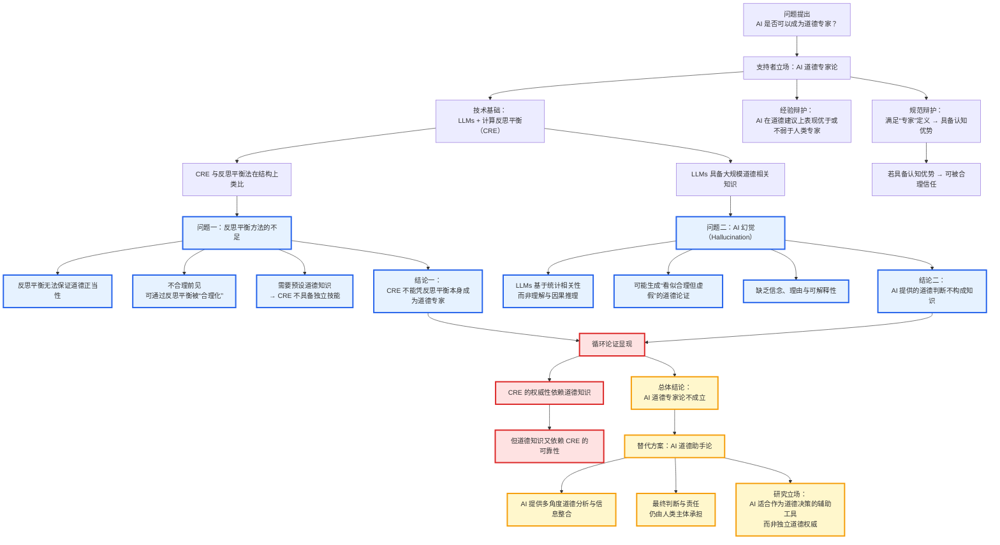
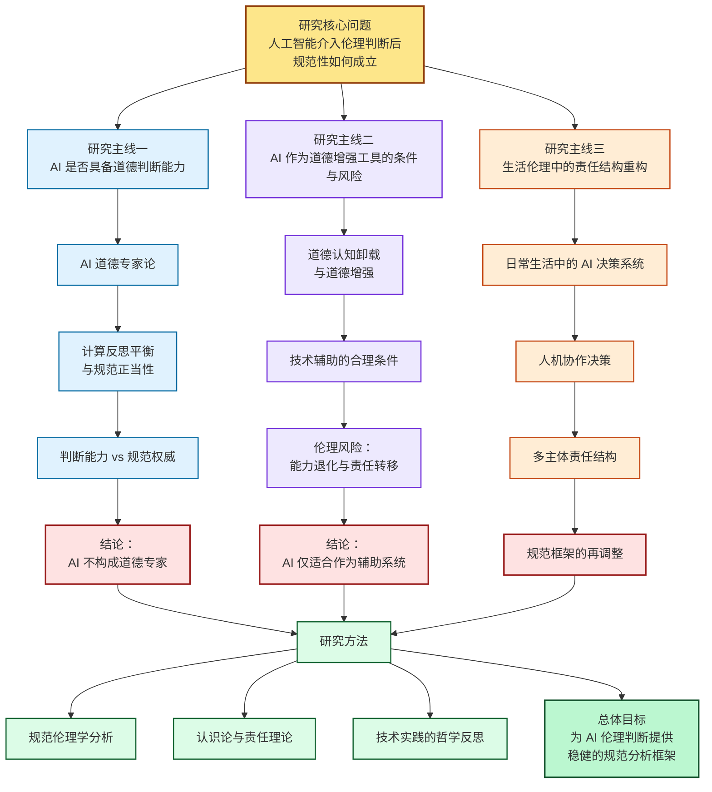

# 博士研究生申请考核汇报  
## 伦理学方向

**解光环**  
西藏民族大学  
---

# 考生基本情况  
## Self-Introduction

Good morning, professors.

My name is Guanghuan Xie.  
I hold a bachelor’s degree in Applied Psychology and am currently completing my master’s studies.

My academic background combines psychology, philosophy, and ethics.  
In recent years, my main research interest has focused on artificial intelligence ethics,  
especially moral judgment, responsibility, and ethical risks in AI-assisted decision-making.

Thank you for your attention.

---

# 教育背景

- **本科阶段**  
  安徽师范大学 · 应用心理学  
  学习心理学理论、统计方法与实验研究

- **硕士阶段**  
  西藏民族大学 · 宗教学  
  接受哲学、伦理学与跨学科研究训练  
  研究逐步转向伦理学与技术问题

---

# 学习成绩与获奖情况

- 获得研究生学业奖学金  
  （2023–2024 学年，2025–2026 学年）

- 全国哲学研究生学术创新论坛  
  论文二等奖（中国人民大学）

- 硕士阶段在系统完成宗教学与哲学相关课程训练的基础上，重点接受了规范伦理学、诠释学与证词哲学方向的科研训练，积极参与校内外学术交流。期间多次参加全国性学术会议与研究生论坛，包括第一届中国科技伦理高峰论坛、第九届中国诠释学青年论坛、2024年中国诠释学专业委员会年会等，并在中国人民大学哲学院举办的全国哲学研究生学术创新论坛中进行论文汇报并获二等奖。同时，围绕证词哲学与人工智能伦理问题开展研究，已有论文发表于学术期刊，另有英文论文进入国际期刊外审阶段，逐步形成较为清晰且稳定的研究方向。

---

# 外语与技术能力

- **英语能力**  
  能够阅读本领域英文文献  
  并借助 AI 工具进行学术写作与整理

- **德语基础**  
  系统学习德语  
  用于阅读德国哲学与伦理学文献

- **计算机与技术能力**  
  - 国家计算机三级（优秀）  
  - 熟悉 AI 工具与科研辅助系统  
  - 具备基础编程理解能力

---

# 科研能力  

## 研究兴趣的形成

- 本科阶段关注心理机制与判断行为  
- 硕士阶段转向伦理学与规范问题  
- 随着 AI 技术进入判断与决策领域  
  开始系统关注人工智能伦理问题

研究核心：  
**当判断不再完全由人类完成时，伦理结构如何变化**

---

# 硕士阶段科研工作

- 关注大语言模型在伦理判断中的作用  
- 分析 AI 是否能够提供可依赖的道德建议  
- 探讨人类在 AI 介入下的责任变化与能力退化风险

研究以规范伦理分析为主  
而非技术系统设计

---

# 已取得的科研成果

- *Why AI Cannot Be a Moral Expert: A Critique of Computational Reflective Equilibrium and the AI Illusion*  
  提出对 AI 道德专家论的系统批判  
  （Science and Engineering Ethics，外审中）

- 本文聚焦当代 **AI 道德专家论**，重点分析以大语言模型（LLMs）与**计算反思平衡**为核心的主流论证路径  
- 该立场依赖两项关键前提：  
  - 反思平衡方法足以奠定道德判断的规范正当性  
  - LLM 生成的道德判断具有可靠的认识论地位  
- 文章论证表明，上述前提分别面临**输入依赖问题**与**AI 幻觉引发的认识论不足**，并在论证中形成循环  
- 基于此，本文不赞成 AI 作为**独立道德专家**的强主张，转而支持更为审慎的 **AI 道德助手论**

---

---

# 研究立场与方法

- 不将 AI 视为独立道德主体  
- 反对将伦理判断完全技术化  
- 强调规范伦理学的基础研究

主要方法：
- 规范伦理分析  
- 概念澄清  
- 哲学与道德心理学结合

---

# 博士阶段研究计划

- 博士阶段研究以**人工智能伦理学**为核心研究方向，重点关注技术系统介入判断与决策过程后，伦理判断结构与责任结构的变化  
- 研究聚焦三类基础问题：  
  - 人工智能是否具备道德判断能力，以及其判断在何种意义上具有规范相关性  
  - 人类在依赖 AI 进行伦理判断与决策时，道德能力是否发生转移或削弱  
  - 人机协同决策情境中，道德责任如何在个体、制度与技术系统之间分配  
- 方法上以**规范伦理学与应用伦理学**为基础，结合对大语言模型行为特征的分析，避免将技术能力直接等同于伦理正当性  
- 研究目标
  - 通过概念澄清与论证分析，为 AI 在伦理领域中的合理定位提供规范依据

  
开展**扎实、可积累的基础伦理研究**

---

---

# 学术目标与态度

- 长期从事伦理学基础问题研究  
- 保持对技术发展的审慎态度  
- 避免技术乐观主义与空泛规范

---

# 感谢各位老师的聆听。
